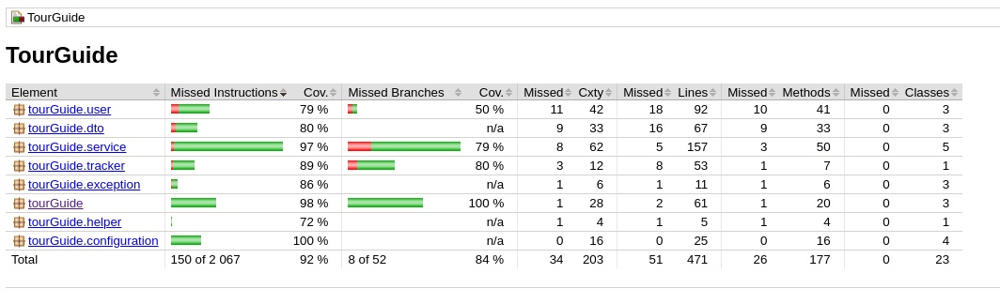

# TourGuide

TourGuide is a Spring Boot application and a centerpiece of the portfolio of TripMaster applications.

It allows users to see what are the nearby tourist attractions and get discounts on hotel stays as well as on tickets to various shows.

## Project objectives

As things stand, the TourGuide system is simply too slow to serve many customers.

Users have noticed this and are complaining about poor performance.
Previously, the tourGuide application frequently updated their localisation but now it's too slow.

The aim of the project is to improve the application's performance.

## Technical Documentation

More detailed technical documentation is available in hmtl format at the following URL: [http://tour-guide-docs.readthedocs.io/](http://tour-guide-docs.readthedocs.io/)

You can, if you prefere, download it in PDF or Epub format, just by clicking on the button "v:lastest" on the bottom right of page.

## Running the application locally

There are several ways to run application on your local machine. One way is to execute the main method in the com.nnk.springboot.Application.java from your favorite IDE.

Alternatively you can use the Spring Boot Gradle plugin like so:

```shell
gradle bootRun
```
## Technical:

This upgraded application uses this dependencies:

    * SpringBoot 2.7.12
    * Java 8
    * Actuator 2.7.12
    * Gradle 7.2
    * JavaMoney 1.3
    * Google Gson 2.8.9
    * ModelMapper 3.1.1
    * Google-java-format 1.17.0
    * Junit-jupiter-api 5.9.3
    * Awaitility 4.2.0
    * Hamcrest 2.1 
    * Mockito 4.5.1
    * Json-path 2.7.0
    * Assertj-core 3.22.0
    * Jacoco 0.8.4
    * Log4j2


## Run test

We used TDD to implement code in this project:

So, from creation of integration and unit tests, we created the source's code and check it to be sure of its correct working.

* To run tests, you can use command: 

    ```shell
    gradle test
    ```

## Jacoco Coverage


A report of coverage is automatically done when you launch tests.

<p align="center" width="90%">

</p>

You can access to it at location :

* `build/jacocoHtml/index.html`  after launch in directory TourGuide:
    ```shell
    gradle test
    ```


## Versions

* V1.0.0 :
    * Update of application's dependencies
    * implementation of services to respect MVC architecture 
    * Using concurrency to improve performance of application
    * Correction of problems reported by users
    * Creation of pipeline CI/CD in Gitlab to improve quality process