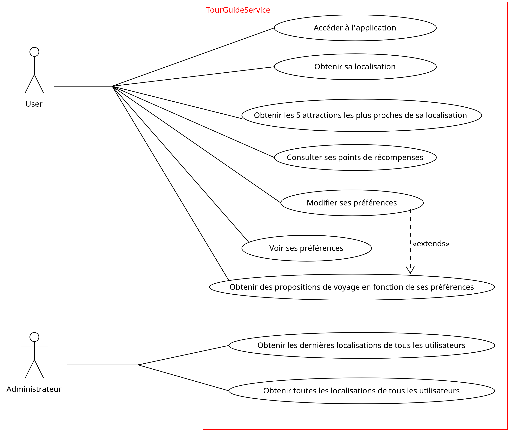

****************
Caractéristiques
****************

Dans ce chapitre, vous trouverez l'ensemble des fonctionnalités que propose l'application TourGuide à ses utilisateurs ainsi qu'à ses administrateurs. De part sa conception (REST API), chacunes de ses fonctionnalités n'est accessible aujourd'hui que depuis un endpoint bien prédéfini. Il est biensur évident que pour, une question de faciliter d'utilisation avec un téléphone mobile, l'application se verra plus tard aggrémenter d'une IHM coté frontEnd qui utilisera ces endpoints...

Fonctionnalités du projet
=========================

Pour permettre une compréhension globale des fonctionnalités de l’application nécessitant une amélioration de performance de temps, nous avons définit **Le diagramme de cas d'utilisation** suivant:

User Stories & critéres d'acceptation
=====================================

A partir de ce diagramme de cas d'utilisation, nous pouvons donc déterminer les user stories et leurs critéres d'acceptation suivantes:

1. **En tant qu'utilisateur , je veux pouvoir accéder à l'application'**

        * **Scénario** l'utilisateur a accés à internet.
        * **Etant donné** que je suis un utilisateur.
        * **Lorque** je rentre l'URL "http://localhost:8080".
        * **Alors** j'accède a la page d'accueil de TrouGuide".

2. **En tant qu'utilisateur , je peux visualiser ma dernière localisation**  
        
        * **Scénario** l'utilisateur a accés à internet.
        * **Etant donné** que je suis un utilisateur.
        * **Lorque** je rentre l'URL "http://localhost:8080/getLocation?userName=<mon nom d'utilisateur>".
        * **Alors** j'accède a la page d'accueil de TourGuide".

3. **En tant qu'utilisateur , je peux visualiser les 5 attractions les plus proches de moi**  
        
        * **Scénario** l'utilisateur a accés à internet.
        * **Etant donné** que je suis un utilisateur.
        * **Lorque** je rentre l'URL "http://localhost:8080/getNearbyAttraction?userName=<mon nom d'utilisateur>".
        * **Alors** j'accède a la page me donnant la liste des 5 attractions les plus proches de ma localisation (triées par distance).

#. Améliorer les performances de RewardsCentral
~~~~~~~~~~~~~~~~~~~~~~~~~~~~~~~~~~~~~~~~~~~~~~~