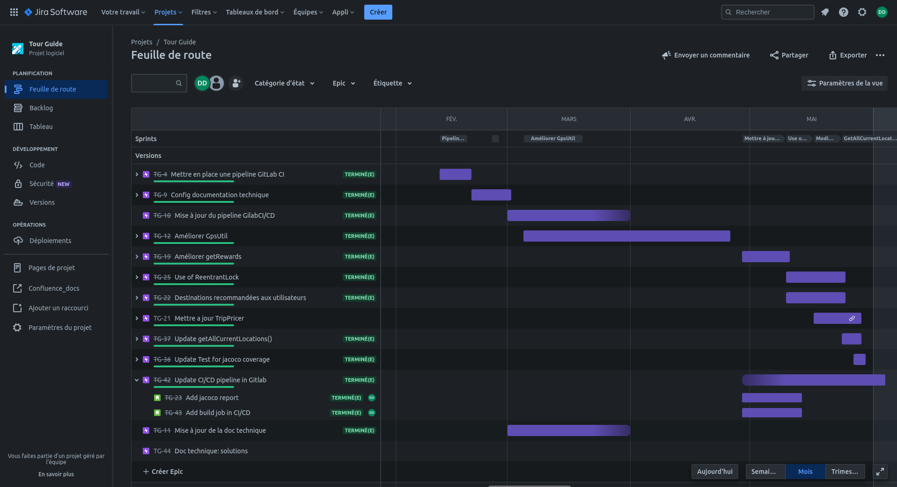
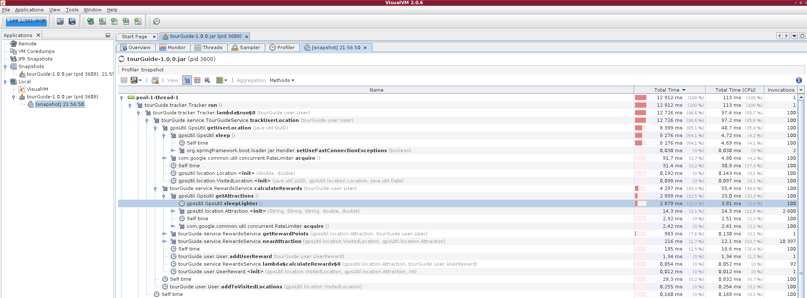

.. _resolution-pb:

************************
Résolution des problèmes
************************

Dans ce chapitre, nous allons reprendre les problèmatiques exposées au §1.1.

Pour chacune d'entre elles, nous verrons la démarche suivie pour la résolution de ces dernières, les changements et tests mis en oeuvre, ainsi que le résultat obtenu à la suite des refactorisations de code.

Préambule
=========

La résolution des problèmes rencontrés a été effectuée avec l'outil Jira, pour suivre une démarche agile. Chaque sprint (épic) corresponds à une étape de correction, lesquels sont constitués de tickets permettant de détailler chaque point important du processus d'amélioration de l'application. 

Mise à niveau de l'application
==============================

Avant de commencer, il a fallu mettre à jour l'application et ses dépendances au moyen de Gradle. A aujourd'hui, l'application utilise Gradle version 7.2 ce qui permet de rendre visible toutes les tasks disponibles pour ce projet (ce qui n'était pas le cas avec l'ancienne version...)

Les versions de SpringBoot et de Junit ont également été upgradée de sorte de pouvoir utiliser les dernières annotations et, par exemple,  utiliser des test paramétrés plus facilement...

Nous sommes aussi passé à la jdk 11 pour pouvoir utiliser JVisualVM et profiler notre application pour résoudre les lenteurs relatées par les utilisateurs.

-----------

Problèmatique rencontrée
------------------------

Une fois l'application upgradée et lancée , l'exception suivante est apparue immédiatement :

.. code-block:: shell

    java.lang.NumberFormatException: For input string: "-166,341300"
    at sun.misc.FloatingDecimal.readJavaFormatString(FloatingDecimal.java:2043)
    at sun.misc.FloatingDecimal.parseDouble(FloatingDecimal.java:110)
    at java.lang.Double.parseDouble(Double.java:538)
    at gpsUtil.GpsUtil.getUserLocation(GpsUtil.java:30)
    at tourGuide.service.TourGuideService.trackUserLocation(TourGuideService.java:87)
    at tourGuide.TestRewardsService.userGetRewards(TestRewardsService.java:35)
 

-----------

Explication
-----------

Lors de l’appel à la methode  trackUserLocation() de TourGuideService, on utilise la methode getUserLocation() de GpsUtil qui parse des longitudes et latitudes sous forme de String mais avec une virgule puisque la Locale de notre application n'étant pas definie est,par défaut, en français (ex: 31,765747).

-----------

Résolution
----------

Nous avons setter la user Locale en anglais pour avoir des doubles sous forme de string avec un point et non une virgule. Ainsi le parse en double des longitudes et latitudes ne lève plus d'exception.

Ajout donc dans application.properties de: 

.. code-block:: java

    spring.web.locale=en_EN

Amélioration des performances
=============================

Dans cette  section, nous parlons de l'amélioration des performances de l'application en général.

Que ce soit pour l'appel à **GspUtil** ou à **RewardsCentral**, nous avons constaté une lenteur du à l'appel de certaines méthodes qui renvoient une réponse après un certain temps (utilisation de la methode sleep() pour simuler ce temps de réponse).

-----------

Problèmatique rencontrée
------------------------

Tout d'abord, afin de déterminer au mieux les méthodes qui ralentissaient l'application, nous avons utiliser l'application JVisualVM afin de trouver et vérifier d'ou venaient ces lenteurs.

Ci dessous, une impression d'écran de JVisualVM profilant notre application: 

Nous avons donc pu constater que les lenteurs provenaient des méthodes suivantes:

    * **getUserLocation()** de GpsUtil 
    * **calculateRewards()** de RewardsService

-----------

Explication
-----------
Ces lenteurs contatées par les utilisateurs s'explique par le fait que l'application appelait ces méthodes de manière séquentielle et que ces dernières renvoyaient leur retour avec un temps de réponse aléatoire plus ou moins long (méthode sleep() de substitution).

Par conséquent, plus le nombre d'utilisateurs devenait important et plus le temps de réponse l'était aussi (cf les graphes de performances ci dessous avant refactorisation du code)

-----------

Résolution
----------
 
Après avoir donc identifier les méthodes fautives, nous sommes passés à l'étape de la résolution...

#. Pour respecter la responsabilité unique du principe SOLID et l'architecture MVC en 3 couches distinstes, nous avons crée 3 services dédiés uniquement à la gestion des appels au librairies GspsUtil , RewardsCentral et TripPricer. Ci dessous, respectivement les trois services nouvellement crés:

                        * GpsUtilService
                        * RewardsService
                        * TripPricerService
#. Pour vérifier 
