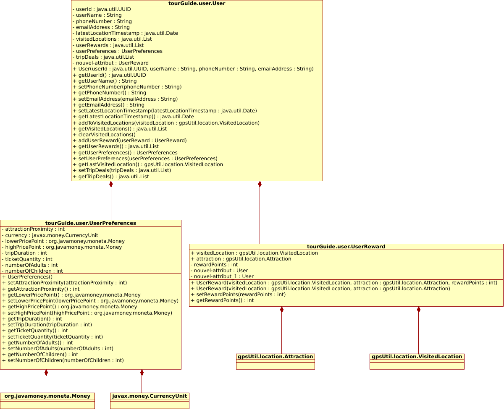
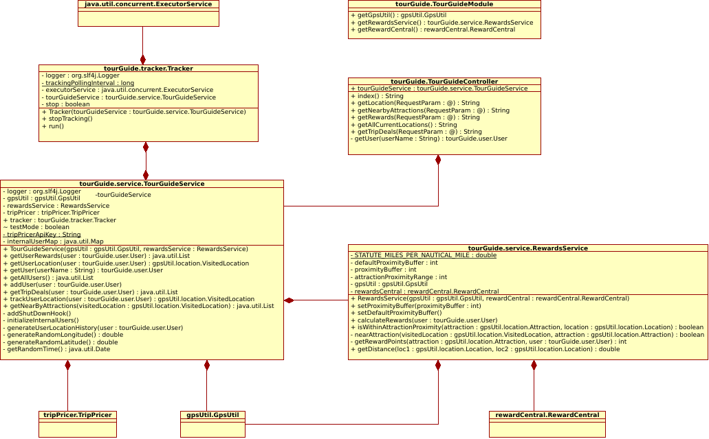
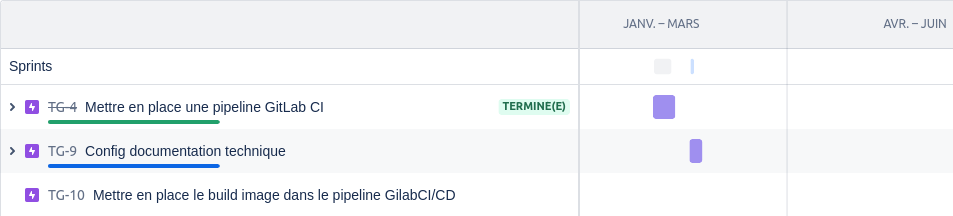

*****************
Solution proposée
*****************

Schémas de conception technique
===============================
A partir du modèle de domaine et des users stories ainsi que de leur diagramme de séquence, vous trouverez ci dessous un diagramme de classe en UML qui permettra de comprendre le fonctionnement, mais surtout de respecter et adopter le langage omniprésent de l’application.

Glossaire
=========

Afin d'avoir une vision plus explicite de l'application, vous trouverez ci dessous le diagramme de classe pour un utilisateur et celui du modèle MVC 

Diagramme de classe représentant un utilisateur
***********************************************

Diagramme de classe de l'architecture 3 tiers
+++++++++++++++++++++++++++++++++++++++++++++

Spécifications techniques
=========================

Solutions alternatives
======================

Calendrier prévisionnel et exigences
====================================

Vous trouverez ci dessous la feuille de route utilisée pour répondre aux besoins du projet.

